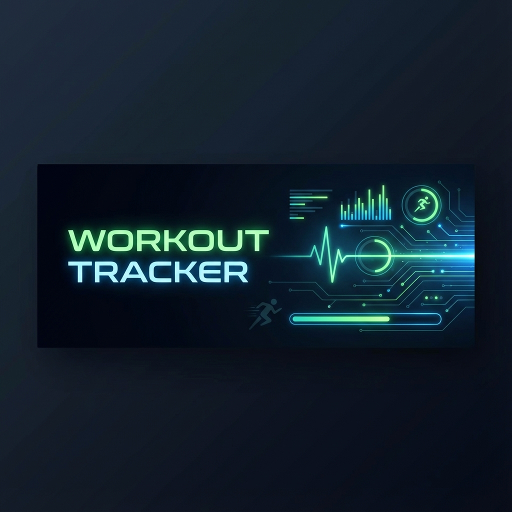

<div align="center">
  

  # 🏋️‍♂️ Workout Tracker G14

  **Track. Analyze. Improve.**
  
  [](https://www.python.org/)
  [](LICENSE)
  []()
  [](https://www.fhnw.ch/)

  <p align="center">
    A powerful, console-based companion for your fitness journey. <br>
    Made with ❤️ by Group 14.
  </p>
</div>

---

## 📖 Table of Contents

- [🧐 About the Project](#-about-the-project)
- [✨ Key Features](#-key-features)
- [🚀 Getting Started](#-getting-started)
- [💻 Usage](#-usage)
- [📂 Project Structure](#-project-structure)
- [👥 The Team](#-the-team)
- [📝 License](#-license)

---

## 🧐 About the Project

Many fitness enthusiasts struggle to consistently track their workout progress. Manual logging is tedious, and without data, motivation fades. 

**Workout Tracker G14** of Felix & Hermanns Programming Class at the University
of Applied Sciences and Arts at the Northwestern Switzerland (FHNW). solves this by providing a robust,
persistent, and easy-to-use command-line interface (CLI) to log exercises, calculate calories, and visualize your history. Whether you're running, swimming, or hitting the gym, we help you keep score of your health.

> *"What gets measured, gets managed."*

---

## ✨ Key Features

| Feature | Description |
| :--- | :--- |
| 📝 **Log Workouts** | Quickly record exercise type, duration, and date. |
| 🔥 **Calorie Calculator** | Automatic calorie estimation based on exercise intensity. |
| 📊 **History & Analysis** | View your training history with smart filtering by month/year. |
| 🤖 **Smart Assistant** | Get personalized workout recommendations based on your calorie goals. |
| 📈 **Deep Analytics** | Visualize your progress with Heatmaps, Radar Charts, and beautiful KPI Dashboards. |
| 💾 **Auto-Save** | Your data is persistent and safely stored in CSV format. |
| 🛡️ **Robust Validation** | Smart input handling ensures your data is always clean. |

---

## 🚀 Getting Started

### Prerequisites

- **Python 3.13** installed on your system.
- A terminal or command prompt.

### Installation

1.  **Clone the repository**
    ```bash
    git clone https://github.com/atanasovmi/Grundlagen-Programmieren-G14.git
    cd Grundlagen-Programmieren-G14
    ```

2.  **Install dependencies** (Optional, for enhanced UI)
    ```bash
    pip install -r requirements.txt
    ```
    *(Note: Libraries like `pandas` and `matplotlib` are required for the Analytics module.)*

---

## 💻 Usage

Run the application directly from your terminal:

```bash
python app.py
```

You will be greeted by the interactive menu:

```text
--- Hauptmenü ---
1. Training eintragen
2. Training bearbeiten
3. Training löschen
4. Historie einsehen
5. Assistent starten
6. Analytiken
0. Beenden
```

Simply enter the number corresponding to the action you want to perform.

---

## 📂 Project Structure

```text
Grundlagen-Programmieren-G14/
├── app.py                  # 🚀 Main entry point
├── assets/                 # 🖼️ Images and static assets
├── data/
│   ├── workout_log.csv     # 💾 Persistent data storage
│   └── generator.py        # 🎲 Test data generator
├── modules/
│   ├── ui.py               # 🎨 User Interface & Menus
│   ├── storage.py          # 💾 File I/O operations
│   ├── workout.py          # 🧠 Core logic & calculations
│   ├── viz.py              # 📈 Visualization & Analytics
│   └── validation.py       # 🛡️ Input Validation
├── requirements.txt        # 📦 Dependencies
└── README.md               # 📄 This file
```

---

## 👥 The Team

We are a team of students from **FHNW** (University of Applied Sciences and Arts Northwestern Switzerland).

| Avatar | Name | Role | GitHub |
| :---: | :--- | :--- | :--- |
| 👨‍💻 | **Mihael Atanasov** | Core Logic & Calorie Calc | [@atanasovmi](https://github.com/atanasovmi) |
| 👩‍💻 | **Nataliia Zvarych** | Validation & Data Handling | [@NataliaZV33](https://github.com/NataliaZV33) |
| 👨‍💻 | **Aydin Ada** | UI/UX & Documentation | [@AydinAdaFHNW](https://github.com/AydinAdaFHNW) |

---

## 📝 License

Distributed under the **MIT License**. See `LICENSE` for more information.

<div align="center">
  <br>
  <p>⭐️ <b>Star this repo</b> if you find it useful!</p>
</div>
